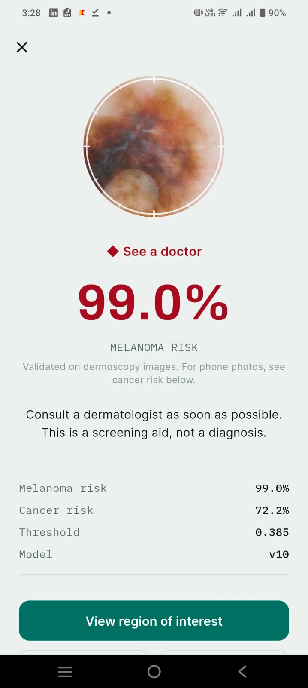
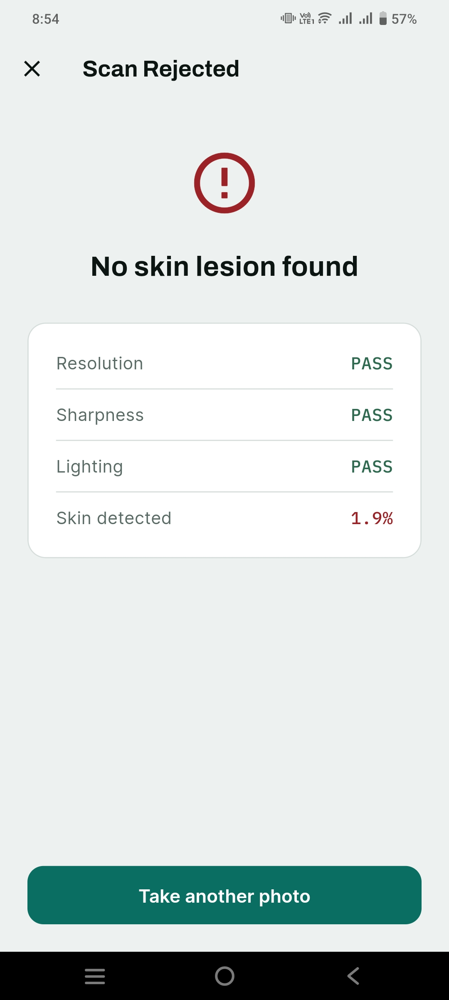
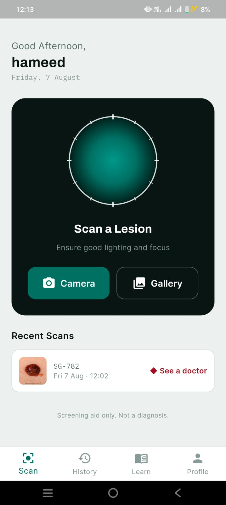

<div align="center">

# SkinGuard AI

**Offline melanoma screening for smartphones, with out-of-distribution safety gating**

[](LICENSE)
[](https://flutter.dev)
[](https://onnxruntime.ai)
[](https://pytorch.org)
[](#)
[](../../releases)
[](https://github.com/muhammad-hameed-ai/skinguard-ai/actions)

**AUC 0.9395** · **Sensitivity 0.9167** · **ECE 0.0072** · **100% offline**

[Results](#results) · [Method](#method) · [Limitations](#limitations) · [Build](#build)

</div>

---

> ⚕️ **Screening aid only. Not a diagnosis.**
> Not cleared by any regulatory body. Always consult a qualified dermatologist.

---

<p align="center">
  
  
  
</p>

## What this is

A skin-lesion screening app that runs three neural networks entirely on-device.
No image ever leaves the phone. Built as a final-year project at CECOS
University of IT & Emerging Sciences, Peshawar.

Unlike most melanoma classifiers, this one **refuses to answer** when the input
isn't a lesion — and reports probabilities that are calibrated, so 77% means
77%.

---

## Results

### Melanoma classifier · dermoscopy · n = 2,832

| Metric | Value |
|:--|--:|
| ROC-AUC | **0.9395** |
| Sensitivity | **0.9167** |
| Specificity | **0.8596** |
| F1 | 0.8893 |
| Brier score | 0.0840 |
| **Expected Calibration Error** | **0.0072** |
| Diagnostic Odds Ratio | 67.4 |

3-fold CV: 0.9425 / 0.9436 / 0.9439 — **σ = 0.0006**

### Cancer classifier · smartphone · n = 447

| Metric | Value |
|:--|--:|
| ROC-AUC | 0.7778 |
| Sensitivity | 0.7574 |
| Specificity | 0.6745 |

### Out-of-distribution gate


99.41% accuracy across `valid_lesion` / `wound` / `not_lesion`.

Rejection verified on device — a textured wall that passed every quality check
was blocked at **1.9% skin detected**, before either classifier ran.

---

## The core finding

**Dermoscopy-trained features do not transfer to smartphone photographs.**

```
melanoma head on dermoscopy         AUC 0.9395
melanoma head on smartphone photos  AUC 0.4941   ← chance
after domain adaptation             AUC 0.7778
```

0.4941 is a coin flip. This is why the system ships **two heads**: the melanoma
head is the primary output but is validated only on dermoscopy; the cancer head
is the statistically supported claim for phone photos.

Clinical fine-tuning also cost **0.056 AUC** on the dermoscopy task
(0.9395 → 0.8837) — measured catastrophic forgetting, and the reason each head
deploys as a separate checkpoint.

---

## Architecture

```
photo
  │
  ├─ quality check ──────── Laplacian ≥ 12 · brightness 35–225
  │                          reject with the failing metric shown
  ├─ ood_gate.onnx ───────── valid_lesion ≥ 0.85, else reject
  │                          rejection happens BEFORE classification
  ├─ melanoma_head.onnx ──── sigmoid(l/0.322) → isotonic → ≥ 0.385
  │                          + CAM heatmap (7×7, forward-only)
  └─ cancer_head.onnx ────── sigmoid(l/0.3837) → isotonic → ≥ 0.44
```

**Backbone:** EfficientNet-B2 (8.6M params) · GeM pooling · SE attention ·
LayerNorm head · dual task heads + CAM branch.

**Explainability:** CAM, not Grad-CAM. Grad-CAM requires a backward pass, which
ONNX Runtime Mobile cannot perform. A learned 1×1-conv branch produces the
heatmap forward-only. Peak localisation **68.4%** — stated in-app, not hidden.

---

## Data

| Dataset | Images | Domain | Role |
|:--|--:|:--|:--|
| ISIC 2019 + 2020 | 11,400 | dermoscopy | training |
| Bhavesh Melanoma | 13,879 | dermoscopy | training |
| PAD-UFES-20 | 2,298 | **smartphone** | domain adaptation |
| Natural Images | 13,798 | objects | OOD negatives |
| Intel Image Classification | 24,335 | scenes | OOD negatives |

> Images are **not** redistributed here. Licences permit research use, not
> redistribution. `ml/01_data_quality.py` documents acquisition.

### Quality control

```
raw pool                    27,577
  quality rejects           −1,965
  near-duplicates (pHash)   −3,594
  train/test leakage        −1,293   ←
                            ───────
usable                      20,582
```

**1,293 images existed in both train and test partitions.** Each was a free
correct answer at evaluation. A leakage audit is rarely reported in comparable
work; reported metrics here are free of memorisation artefacts.

---

## Findings

**1 · Train/test leakage is pervasive and rarely checked**
1,293 duplicates spanned both partitions. Removing them changed a
memorisation-inflated result into a defensible one.

**2 · Standard sharpness thresholds destroy dermoscopy datasets**
Laplacian variance ≥ 50 — the photography default — rejects ~50% of dermoscopic
images. A lesion is a smooth region on smooth skin and immersion fluid removes
surface texture. Validated value: **12**.

**3 · Hand-crafted ABCD features do not transfer across imaging domains**
AUC 0.691 on dermoscopy, **0.488 on smartphone** — with border scores
saturating at 7.34/8 for *both* classes. Not previously quantified.

**4 · Catastrophic forgetting is measurable and consequential**
Clinical fine-tuning cost 0.056 AUC on dermoscopy, justifying separate
deployed heads.

**5 · INT8 quantisation fails on EfficientNet**
SE blocks and SiLU are unsupported by dynamic quantisation. Result: 0.16 AUC
worse **and 10× slower** due to dequantise→float→requantise wrappers.

**6 · The domain gap can be measured and largely closed**
AUC 0.494 → 0.778 on smartphone images.

---

## Calibration

Two stages, both required:

```python
p = sigmoid(logit / temperature)      # temperature scaling
p = interpolate(p, isotonic_curve)    # isotonic regression
```

| | before | after |
|:--|--:|--:|
| ECE | 0.2235 | **0.0072** |
| Brier | 0.1411 | 0.0840 |

Reliability after calibration:

```
predicted   observed    error
    0.355      0.354   +0.001
    0.469      0.469   +0.000
    0.774      0.782   −0.008
worst bin error 0.045
```

Most published work reports AUC and never checks whether the probabilities mean
anything.

---

## Limitations

Stated openly, in the app and here.

- **Melanoma head is dermoscopy-validated.** Smartphone performance is
  unproven; the cancer head is the supported claim for phone photos.
- **Cancer head is a stratifier, not a calibrated probability** (Brier 0.19,
  fitted on 447 images).
- **Fitzpatrick V–VI severely under-represented** — 10 and 1 images
  respectively. Dark-skin performance is **unvalidated**, a genuine gap for a
  Pakistan deployment where most users are type IV–V.
- **Wound rejection trained on synthetic images only.** Real wound photographs
  were not available.
- **CAM peak localisation 68.4%** — roughly 1 in 3 overlays may be off-centre.
- **OOD negatives were object and scene photography at normal distance.** Macro
  textures resembling pigmented lesions (corroded metal, bark, mineral
  surfaces) remain untested.
- **PAD-UFES-20 contains only 47 melanoma images after QC** — the reason the
  clinical task was reframed as cancer vs non-cancer.

---

## Build

### Prerequisites
```
Flutter 3.24.5 · Dart 3.5.4 · JDK 17 · Android SDK 34+
```

### Steps
```bash
git clone https://github.com/muhammad-hameed-ai/skinguard-ai.git
cd skinguard-ai/app

# Models are distributed via Releases, not in the repo
# Download and extract into app/assets/models/
curl -L -o models.zip \
  https://github.com/muhammad-hameed-ai/skinguard-ai/releases/latest/download/models.zip
unzip models.zip -d assets/models/

flutter pub get
flutter run
```

### ⚠️ Toolchain

Flutter 3.24 is **incompatible with Java 25** — its Groovy build scripts crash
on Gradle 9.x with `groovy.xml.QName`. Pin:

```properties
# android/gradle/wrapper/gradle-wrapper.properties
distributionUrl=...gradle-8.13-all.zip

# android/settings.gradle
com.android.application version '8.7.0'
org.jetbrains.kotlin.android version '2.0.21'
```

On memory-constrained machines:

```properties
# android/gradle.properties
org.gradle.jvmargs=-Xmx2048m -XX:MaxMetaspaceSize=512m
kotlin.daemon.enabled=false
```

---

## Reproducing the models

```bash
cd ml
pip install -r requirements.txt

python 01_data_quality.py     # QC, dedup, leakage audit
python 02_ood_gate.py         # ~30 min GPU
python 04_classifier.py       # ~5 h GPU, 3-fold
python 05_calibration.py      # temperature + isotonic
python 06_export_onnx.py      # export + verify
```

Total ~6 GPU-hours on a single T4. Datasets must be acquired separately — see
`ml/README.md`.

---

## Deployment constraints

Six rules. Breaking any degrades accuracy **with no error thrown**.

| Constraint | Consequence |
|:--|:--|
| Preprocessing = resize + normalise **only** | −0.18 AUC |
| **NCHW** layout, not NHWC | garbage output |
| Temperature **then** isotonic | mis-classification |
| Clamp display to 0.01–0.99 | "100% melanoma" is clinically false |
| Laplacian ≥ 12, not 50 | rejects ~50% of valid dermoscopy |
| Each head from its own ONNX file | 0.056 AUC penalty otherwise |

> **On preprocessing:** hair removal, colour constancy and CLAHE were used to
> *clean the dataset* — deciding which images to keep. They were never applied
> during training. Applying them at inference measured 0.9395 → 0.7535.

Full spec: [`docs/DEPLOYMENT.md`](docs/DEPLOYMENT.md)

---

## Citation

```bibtex
@software{hameed2026skinguard,
  author  = {Hameed, Muhammad},
  title   = {SkinGuard AI: Offline Melanoma Screening with
             Out-of-Distribution Safety Gating},
  year    = {2026},
  school  = {CECOS University of IT and Emerging Sciences, Peshawar},
  url     = {https://github.com/muhammad-hameed-ai/skinguard-ai}
}
```

---

## License

Code: [MIT](LICENSE). Datasets retain their original licences and are not
redistributed. Trained models are released for research use.

---

<div align="center">

**CECOS University of IT & Emerging Sciences, Peshawar** · 2026
Supervised by Dr. Nazir Jan and Mr. Asad Javed

</div>
